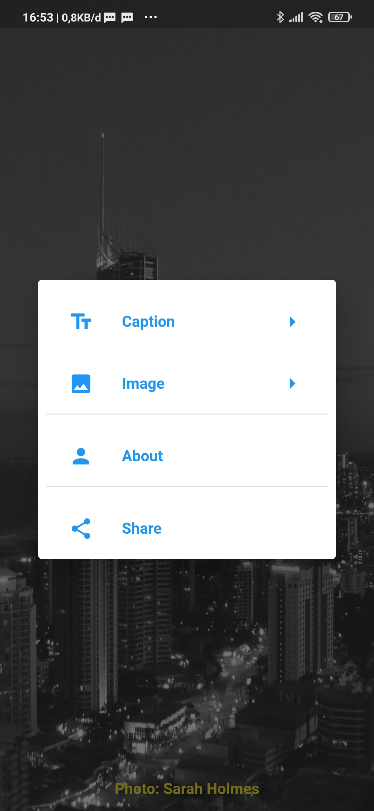

# Quotes Maker
Quotes maker is a simple app that help you create quotes image and share with anyone. Built using FLutter framework and Cubit state management.

  

  
  

<tr>

  
  

  

  
  

  
  

  </tr>
  
Feel free to use and contribute to this app.

## License
[GNU General Public License](https://www.gnu.org/licenses/gpl-3.0.html).
